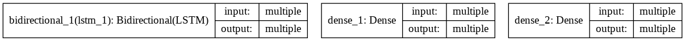
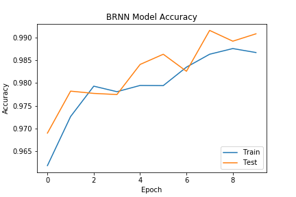
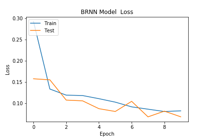

# Using Bidirectional LSTM based RNN to classify DDoS attack packets

The design of this classifier was inspired by [DeepDefense: Identifying DDoS Attack via Deep Learning](https://ieeexplore.ieee.org/document/7946998) paper. 

## Architecture of the model



## Usage

Run the ```brnn_classifier.ipynb``` notebook.

## Results

### Plot of accuracy


### Plot of loss


